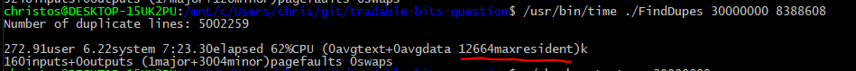
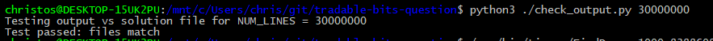
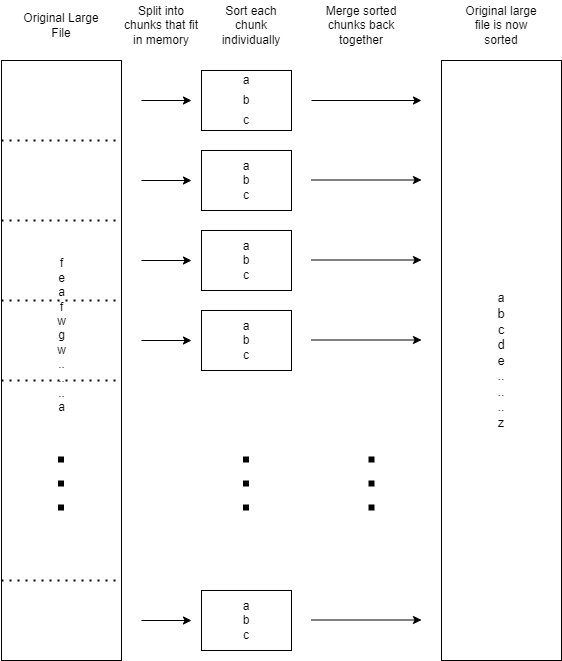

# Tradable Bits Application Challenge

## Question 1:
**Write a program that finds and prints duplicate lines in an unsorted text file 1Tb big. Assuming the memory of your computer is 16Gb, which is not enough for an entire set of data in any shape or form.**

### Approach:
Sort entire file using external merge sort algorithm. Once the file is sorted, it is easy to find duplicate lines. Since the file is sorted, the duplicate lines will be adjacent, and therefore only a small buffer is needed to track duplicates.

To sort the large file, since the entire file cannot fit into memory, an external merge sort algorithm is used. The large file is split into smaller chunks that fit within the memory of the computer, and then each of these chunks is sorted individually. The sorted chunks are stored in temporary files. Then a merge sort is performed on these temporary files, by reading one line at a time from the  temporary files, and writing the smallest line back to the original large file. At the end, the temporary files are deleted, and the original large file is now sorted.

### Assumptions
A few assumptions were made to simplify the development of a proof of concept algorithm. The code could be extended to account for each of these assumptions if necessary.

1. There are no blank lines in the text file.
2. Each line appears at most twice in the input file (only tracking duplicate pairs).
3. Not really an assumption, but an alteration. Because with the larger tests, there can sometimes be 1000s of duplicate lines, instead of printing them, I outputted them to a text file.

### Testing
As a 1TB sized testing file would not fit on my computer, the problem was scaled down for testing. Instead of a 1 TB file with 16 GB of memory, a 1 GB sized file was used, with the goal of using under 16 MB of memory.

To create test files, a python script was used to generate files containing  random text, with a chance for each line to be inserted twice. The lines were then shuffled. As the contents of the text file for this problem were not stated, I used randomly generated UUIDs as the sample text data. Each line of the text file was  a UUID. This had the advantage of ensuring that no two lines were duplicated by accident, and so the true number of duplicates could be known.

Test data can be generated using the python script: `python ./generate_test_data.py <NUM_LINES>`. Where the NUM_LINES argument can be used to specify the length of the test file. 30,000,000 lines is about a 1 GB sized test file.

As well as the test input file of random text, a second file was created listing only the duplicate lines. Then the 'check_output.py' script could be used to  compare the solution and output files to see if the program produced the correct results.

As well as correctness, it is important to test the amount of memory the program is using. To do this, the GNU *time* program is used. This program reports execution time, as well as the maximum memory used over the course of program execution (max resident). It can be run as follows (on unix systems):

`/usr/bin/time ./programName`

### Build & Run
The program can be built using the follow command (on Linux or Windows):

`g++ -o FindDupes FindDuplicates.cpp`

This will create the program file which can be run with either:

**Linux:** `./FindDupes <NUM_LINES> <MAX_CHUNK_SIZE>`

**Windows:** `./FindDupes.exe <NUM_LINES> <MAX_CHUNK_SIZE>`

Example, to run the test with 1,000,000 lines and with a chunk size of 1 MB: 

`./FindDupes 1000000 1048576`

#### Program takes two arguments:

`NUM_LINES`: used to tell the program the names of the input and output files generated with `generate_test_data.py`.
`MAX_CHUNK_SIZE`: the max amount of memory (in bytes) that each chunk should take up. Keep in mind there is also some overhead for the rest of the program required. This is just one portion of the overall memory used by the program.

Note: the program expects to find the file `INPUT_test_data_x.txt` in the `./testing` directory. It will likewise output `SORTED_test_data_x.txt` and `OUTPUT_test_data_x.txt` in the `./testing` directory. x is the number of lines in the test data file.

#### Generating test data

`python ./generate_test_data.py <NUM_LINES>`

Where NUM_LINES is the number of lines in the input random text file.

#### Checking results

After running the find duplicates program, the output can be checked by running the check_output.py python script:

`python check_output.py x`

Where x is the number of lines in the test data file. Ex:

`python check_output.py 1000000`

### Results
Instead of a 1 TB sized file, a test file with 30,000,000 lines, which is 1 GB large can be used. In this scaled down test, the goal is to sort the file while using no more than 16 MB of memory. To accomplish this, a MAX_CHUNK_SIZE of 8 MB (or 8,388,608 bytes) is used. When running the program with `/usr/bin/time`, you can see that the program only uses approximately 12.36 MB of ram, which is within the acceptable limit.

## Question 2:
**How long do you estimate the program above to take if one read/write of 1Mb  from disk takes 3ms? CPU processing time will be equal to disk IO time.**

To calculate this, it must first be determined how much data the program is reading/writing to the disk. 

The first phase is simply reading the data from the large input file in chunks, and writing it to temporary files, so that is one read and one write of 1 TB.\

Phase 1 time = 2 * ( 3ms / 1 MB ) * 1 TB = 6,291,456 ms

The second phase is the external merge sort. In this part of the program, the contents of every temporary file are read once (1 TB worth of reads), and this data is also all written to the sorted file (1 TB worth of writes).\

Phase 2 time =  2 * ( 3ms / 1 MB ) * 1 TB = 6,291,456 ms

Lastly, the third phase is simply reading the sorted file (1 TB worth of reads), and finding duplicates. Note: the program as I wrote it outputs duplicates to a text file, so technically that is some additional writes, but the original problem states that duplicates should be printed to the console instead. So I will not count the additional writes from writing the duplicates to a file, as the code could easily be modified to do this, and that is what the original problem states.\

Phase 3 time = 1 * ( 3ms / 1 MB ) * 1 TB = 3,145,728 ms

**Total time** = Phase 1 time + Phase 2 time + Phase 3 time = 15,728,640 ms = 4 Hours 22 Minutes 8 Seconds

## External Merge Sort Visualized:

